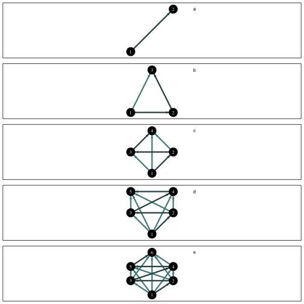
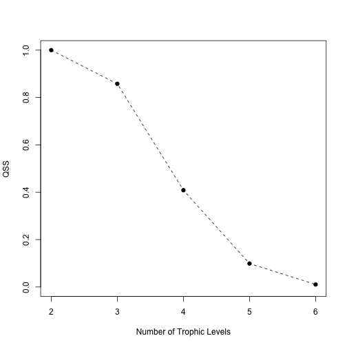
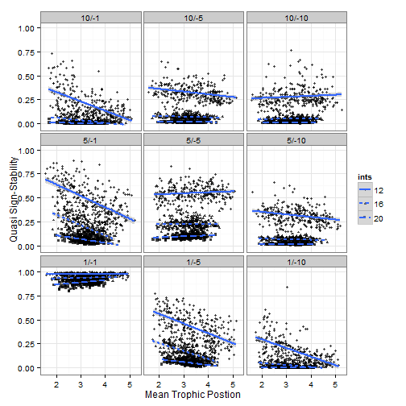
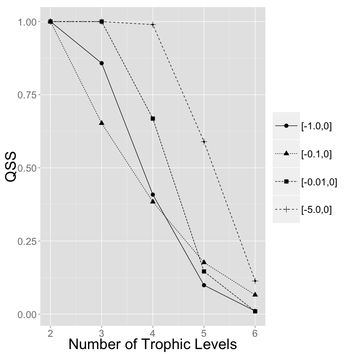

Code used in "Why are there so few trophic levels: selection against instability explains the pattern"
=================================================================================== 
  
  
The next step is to create the various adjacency matrices for each of the perturbed food chains. Below I will create the sign matrix structure for each perturbed chain of 2, 3, 4, 5, and 6 levels. A -1 indicates the impact of a predator on its prey (negative), while a 1 indicates the impact of the prey on the predator (positive). 
  

```r
sign2 <- matrix(c(-1, -1, 1, 0), nrow = 2, ncol = 2)
diag(sign2) <- -1

sign3 <- matrix(c(-1, -1, -1, 1, 0, -1, 1, 1, 0), nrow = 3, ncol = 3)
diag(sign3) <- -1

sign4 <- matrix(nrow = 4, ncol = 4)
sign4[lower.tri(sign4)] <- -1
sign4[upper.tri(sign4)] <- 1
diag(sign4) <- -1

sign5 <- matrix(nrow = 5, ncol = 5)
sign5[lower.tri(sign5)] <- -1
sign5[upper.tri(sign5)] <- 1
diag(sign5) <- -1

sign6 <- matrix(nrow = 6, ncol = 6)
sign6[lower.tri(sign6)] <- -1
sign6[upper.tri(sign6)] <- 1
diag(sign6) <- -1
```

  
For simplicity I combine these matrices into a list: 
  

```r
sign.matrices <- list(sign2, sign3, sign4, sign5, sign6)
names(sign.matrices) <- c("2 sp", "3 sp", "4 sp", "5 sp", "6 sp")

sign.matrices
```

```
## $`2 sp`
##      [,1] [,2]
## [1,]   -1    1
## [2,]   -1   -1
## 
## $`3 sp`
##      [,1] [,2] [,3]
## [1,]   -1    1    1
## [2,]   -1   -1    1
## [3,]   -1   -1   -1
## 
## $`4 sp`
##      [,1] [,2] [,3] [,4]
## [1,]   -1    1    1    1
## [2,]   -1   -1    1    1
## [3,]   -1   -1   -1    1
## [4,]   -1   -1   -1   -1
## 
## $`5 sp`
##      [,1] [,2] [,3] [,4] [,5]
## [1,]   -1    1    1    1    1
## [2,]   -1   -1    1    1    1
## [3,]   -1   -1   -1    1    1
## [4,]   -1   -1   -1   -1    1
## [5,]   -1   -1   -1   -1   -1
## 
## $`6 sp`
##      [,1] [,2] [,3] [,4] [,5] [,6]
## [1,]   -1    1    1    1    1    1
## [2,]   -1   -1    1    1    1    1
## [3,]   -1   -1   -1    1    1    1
## [4,]   -1   -1   -1   -1    1    1
## [5,]   -1   -1   -1   -1   -1    1
## [6,]   -1   -1   -1   -1   -1   -1
```

   
The function `analyze.eigen' randomly fills a signed matrix and calculates the eigenvalue with the largest real part. This function takes in a sign matrix (a matrix of +1s, -1s, and 0s) and replaces the $a_{ij}$ with values randomly drawn from predefined uniform distributions.  
  

```r
analyze.eigen <- function(m) {
    for (i in 1:nrow(m)) {
        for (j in 1:nrow(m)) {
            ifelse(m[i, j] == 1, m[i, j] <- runif(1, 0, 10), NA)
            ifelse(m[i, j] == -1, m[i, j] <- runif(1, -1, 0), NA)
        }
    }
    for (i in 1:nrow(m)) {
        if (m[i, i] < 0) {
            m[i, i] <- -1
        }
    }
    ev <- max(Re(eigen(m)$values))
    return(ev)
}
```

  
### Figure 1  
  
These matrices can be visualized as presented in figure one with the following code (note: requires the igraph library):  
  
But first the sign matrices need to be converted to graph objects


```r
require(igraph)
```

```
## Loading required package: igraph
```

```r

graph.chains <- lapply(sign.matrices, graph.adjacency)
```

  

```r

twospec2 <- matrix(c(1, 1, 2, 2), nrow = 2, ncol = 2, byrow = T)
threespec2 <- matrix(c(1, 1, 3, 1, 2, 2), nrow = 3, ncol = 2, byrow = T)
fourspec2 <- matrix(c(1, 1, 2, 2, 0, 2, 1, 3), nrow = 4, ncol = 2, byrow = T)
fivespec2 <- matrix(c(2, 1, 3, 2, 1, 2, 3, 3, 1, 3), nrow = 5, ncol = 2, byrow = T)
sixspec2 <- matrix(c(2, 1, 3, 2, 1, 2, 3, 3, 1, 3, 2, 4), nrow = 6, ncol = 2, 
    byrow = T)

layouts <- list(twospec2, threespec2, fourspec2, fivespec2, sixspec2)
text <- c("a", "b", "c", "d", "e")

for (i in 1:5) {
    E(graph.chains[[i]])$color = "darkslategray4"
    E(graph.chains[[i]], path = c(1:(i + 1)))$color = "darkslategrey"
}

# jpeg('~/Desktop/chains2.jpeg', width = 400, height = 900, pointsize =
# 25, quality = 100) #code to create as a jpeg file
par(mfrow = c(5, 1), mar = c(0.5, 0.5, 0.5, 0.5))
for (i in 1:5) {
    plot.igraph(graph.chains[[i]], layout = layouts[[i]], vertex.size = 40, 
        vertex.color = "black", vertex.label.color = "white", vertex.label.cex = 1, 
        edge.width = 3, edge.arrow.size = 0.35, frame = T)
    text(2, 1, label = text[i])
}
```

 

```r
# dev.off()
```

  
### Defining the function to calculate stability  

The function `analyze.eigen` randomly fills a signed matrix and calculates the eigenvalue with the largest real part. This function takes in a sign matrix (a matrix of +1s, -1s, and 0s) and replaces the $a_{ij}$ with values randomly drawn from predefined uniform distributions.  
  

```r
analyze.eigen <- function(m) {
    for (i in 1:nrow(m)) {
        for (j in 1:nrow(m)) {
            ifelse(m[i, j] == 1, m[i, j] <- runif(1, 0, 10), NA)
            ifelse(m[i, j] == -1, m[i, j] <- runif(1, -1, 0), NA)
        }
    }
    for (i in 1:nrow(m)) {
        if (m[i, i] < 0) {
            m[i, i] <- -1
        }
    }
    ev <- max(Re(eigen(m)$values))
    return(ev)
}
```

  

Simulation  
--------------------------------------------------  
     
The following code applies the `analyze.eigen` function to each of the 5 sign matrices created above. It then stores the `max(Re(lambda))`, or the eigen value with the largest real part in the `eigenvalues` list. Quasi sign-stability (`qss`) can then be calculated by determining the proportion of the `max(Re(lambda))` that are negative out of the 10000 that are calculated. 
  

```r
eigenvalues <- list()
qss <- list()
for (i in 1:5) {
    eigenvalues[[i]] <- replicate(10000, analyze.eigen(sign.matrices[[i]]))
    qss[[i]] <- sum(eigenvalues[[i]] < 0)/10000
}

names(eigenvalues) <- c("2 sp", "3 sp", "4 sp", "5 sp", "6 sp")
names(qss) <- c("2 sp", "3 sp", "4 sp", "5 sp", "6 sp")
qss
```

```
## $`2 sp`
## [1] 1
## 
## $`3 sp`
## [1] 0.8578
## 
## $`4 sp`
## [1] 0.4085
## 
## $`5 sp`
## [1] 0.0989
## 
## $`6 sp`
## [1] 0.0106
```

  
The results can then be plotted with `qss` as a function of the number of levels:
  

```r
plot(unlist(qss) ~ c(2, 3, 4, 5, 6), ylim = c(0, 1), typ = "o", lty = 2, pch = 21, 
    bg = "black", xlab = "Number of Trophic Levels", ylab = "QSS")
```

 

  
Sensitivity Analysis  
--------------------------------------------------  
  
We performed our sensitivity analysis by simply changing the distributions from which we sampled for the impact of the predator on the prey. The initial simulations were done with the impact of the predator on the prey 10x smaller on average than the reverse impact. This was accomplished with a slight alteration of the `analyze.eigen` function that filled the matrix and calculated the eigenvalues. 

### Sensitivity analysis 1  
  
For this the impact of the predator on the prey was 1/2 the impact of the prey on the predator.  
  

```r
analyze.eigen.sensitivity1 <- function(m) {
    for (i in 1:nrow(m)) {
        for (j in 1:nrow(m)) {
            ifelse(m[i, j] == 1, m[i, j] <- runif(1, 0, 10), NA)
            ifelse(m[i, j] == -1, m[i, j] <- runif(1, -5, 0), NA)  #note the difference in distribution here
        }
    }
    for (i in 1:nrow(m)) {
        if (m[i, i] < 0) {
            m[i, i] <- -1
        }
    }
    ev <- max(Re(eigen(m)$values))
    return(ev)
}
```

  
We can then rerun the simulation on each of the five perturbed food chains:
  

```r
eigenvalues.sensitivity1 <- list()
qss.sensitivity1 <- list()
for (i in 1:5) {
    eigenvalues.sensitivity1[[i]] <- replicate(10000, analyze.eigen.sensitivity1(sign.matrices[[i]]))
    qss.sensitivity1[[i]] <- sum(eigenvalues.sensitivity1[[i]] < 0)/10000
}

names(eigenvalues.sensitivity1) <- c("2 sp", "3 sp", "4 sp", "5 sp", "6 sp")
names(qss.sensitivity1) <- c("2 sp", "3 sp", "4 sp", "5 sp", "6 sp")
qss.sensitivity1
```

```
## $`2 sp`
## [1] 1
## 
## $`3 sp`
## [1] 0.6525
## 
## $`4 sp`
## [1] 0.3839
## 
## $`5 sp`
## [1] 0.1765
## 
## $`6 sp`
## [1] 0.0657
```

  
### Sensitivity analysis 2  
  
For this the impact of the predator on the prey was 100x smaller.  
  

```r
analyze.eigen.sensitivity2 <- function(m) {
    for (i in 1:nrow(m)) {
        for (j in 1:nrow(m)) {
            ifelse(m[i, j] == 1, m[i, j] <- runif(1, 0, 10), NA)
            ifelse(m[i, j] == -1, m[i, j] <- runif(1, -0.1, 0), NA)  #note the difference in distribution here
        }
    }
    for (i in 1:nrow(m)) {
        if (m[i, i] < 0) {
            m[i, i] <- -1
        }
    }
    ev <- max(Re(eigen(m)$values))
    return(ev)
}
```

  
  
We can then rerun the simulation on each of the five perturbed food chains:
  

```r
eigenvalues.sensitivity2 <- list()
qss.sensitivity2 <- list()
for (i in 1:5) {
    eigenvalues.sensitivity2[[i]] <- replicate(10000, analyze.eigen.sensitivity2(sign.matrices[[i]]))
    qss.sensitivity2[[i]] <- sum(eigenvalues.sensitivity2[[i]] < 0)/10000
}

names(eigenvalues.sensitivity2) <- c("2 sp", "3 sp", "4 sp", "5 sp", "6 sp")
names(qss.sensitivity2) <- c("2 sp", "3 sp", "4 sp", "5 sp", "6 sp")
qss.sensitivity2
```

```
## $`2 sp`
## [1] 1
## 
## $`3 sp`
## [1] 1
## 
## $`4 sp`
## [1] 0.6684
## 
## $`5 sp`
## [1] 0.146
## 
## $`6 sp`
## [1] 0.0095
```

  
### Sensitivity analysis 3  
  
For this the impact of the predator on the prey was 1000x smaller.  
  

```r
analyze.eigen.sensitivity3 <- function(m) {
    for (i in 1:nrow(m)) {
        for (j in 1:nrow(m)) {
            ifelse(m[i, j] == 1, m[i, j] <- runif(1, 0, 10), NA)
            ifelse(m[i, j] == -1, m[i, j] <- runif(1, -0.01, 0), NA)  #note the difference in distribution here
        }
    }
    for (i in 1:nrow(m)) {
        if (m[i, i] < 0) {
            m[i, i] <- -1
        }
    }
    ev <- max(Re(eigen(m)$values))
    return(ev)
}
```

  
  
We can then rerun the simulation on each of the five perturbed food chains:
  

```r
eigenvalues.sensitivity3 <- list()
qss.sensitivity3 <- list()
for (i in 1:5) {
    eigenvalues.sensitivity3[[i]] <- replicate(10000, analyze.eigen.sensitivity3(sign.matrices[[i]]))
    qss.sensitivity3[[i]] <- sum(eigenvalues.sensitivity3[[i]] < 0)/10000
}

names(eigenvalues.sensitivity3) <- c("2 sp", "3 sp", "4 sp", "5 sp", "6 sp")
names(qss.sensitivity3) <- c("2 sp", "3 sp", "4 sp", "5 sp", "6 sp")
qss.sensitivity3
```

```
## $`2 sp`
## [1] 1
## 
## $`3 sp`
## [1] 1
## 
## $`4 sp`
## [1] 0.9896
## 
## $`5 sp`
## [1] 0.5896
## 
## $`6 sp`
## [1] 0.1134
```

  
#### Create a plot of the different sensitivity analysis  
  

```r
plot(unlist(qss.sensitivity1) ~ c(2, 3, 4, 5, 6), ylim = c(0, 1), col = "blue", 
    bg = "blue", pch = 24, typ = "o", lty = 3, xlab = "Number of Trophic Levels", 
    ylab = "QSS")
points(unlist(qss.sensitivity2) ~ c(2, 3, 4, 5, 6), col = "red", bg = "red", 
    pch = 22, typ = "o", lty = 2)
points(unlist(qss.sensitivity3) ~ c(2, 3, 4, 5, 6), col = "orange", bg = "orange", 
    pch = 23, typ = "o", lty = 2)
```

 


### Figure 2 code  
  
Plot all together  
  

```r
require(reshape2)
```

```
## Loading required package: reshape2
```

```r
qtab <- list(qss, qss.sensitivity1, qss.sensitivity2, qss.sensitivity3)
names(qtab) <- c("[-1.0,0]", "[-0.1,0]", "[-0.01,0]", "[-5.0,0]")

qss.data <- melt(qtab, id = c("2 sp", "3 sp", "4 sp", "5 sp", "6 sp"))
colnames(qss.data) <- c("QSS", "Levels", "Distribution")
qss.data$Levels <- c(2, 3, 4, 5, 6, 2, 3, 4, 5, 6, 2, 3, 4, 5, 6, 2, 3, 4, 5, 
    6)
qss.data$Distribution2 <- factor(qss.data$Distribution, levels = (c("[-1.0,0]", 
    "[-0.1,0]", "[-0.01,0]", "[-5.0,0]")))

require(ggplot2)
```

```
## Loading required package: ggplot2
```

```r
require(grid)
```

```
## Loading required package: grid
```

```r
qss.plot <- qplot(Levels, QSS, data = qss.data, xlab = "Number of Trophic Levels", 
    margin = T)
qss.plot <- qss.plot + geom_point(aes(shape = qss.data$Distribution2), size = 4)
qss.plot <- qss.plot + geom_line(aes(linetype = qss.data$Distribution2))
qss.plot <- qss.plot + theme(legend.title = element_blank())
qss.plot <- qss.plot + theme(legend.key.size = unit(2, "cm"), legend.text = element_text(size = 20))
qss.plot <- qss.plot + theme(axis.title.x = element_text(size = 30))
qss.plot <- qss.plot + theme(axis.title.y = element_text(size = 30))
qss.plot <- qss.plot + theme(axis.text.x = element_text(size = 20))
qss.plot <- qss.plot + theme(axis.text.y = element_text(size = 20))
```


```r
qss.plot
```

 

