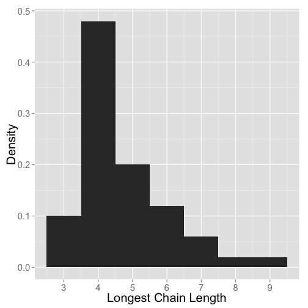
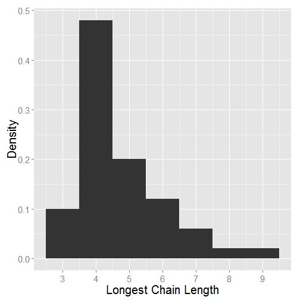

Supplementary Information
==================================================================================


  
Data
-----------------------------------------------------------------------------------------------  
### Data Sources

Three food webs were downloaded from the [Dryad Digital Repository](http://datadryad.org/resource/doi:10.5061/dryad.c213h) (Roopnarine & Hertog 2012a, 2012b). Another seven were available from [Ecological Archives](http://esapubs.org/Archive/search.php) (Hechinger et al. 2011; Mouritsen et al. 2011; Thieltges et al. 2011; Zander et al. 2011; Preston et al. 2012). Fourteen webs were provided by Jennifer Dunne of the [PEaCE lab](http://peacelab.net/) (Baird & Ulanowicz 1989; Warren 1989; Polis 1991a; Hall & Raffaelli 1991; Martinez 1991; Christensen & Pauly 1992; Havens 1992; Goldwasser & Roughgarden 1993; Opitz 1996; Waide & Reagan 1996; Yodzis 1998, 2000; Christian & Luczkovich 1999; Martinez et al. 1999; Memmott et al. 2000; Link 2002) that were analyzed in (Dunne et al. 2002, 2004). The remaining 26 food webs were downloaded from the [Interaction Web Database](http://www.nceas.ucsb.edu/interactionweb/html/thomps_towns.html) (Jaarsma et al. 1998; Townsend et al. 1998; Thompson & Townsend 1999, 2000, 2003, 2005; Thompson & Edwards 2001).
  
  
### References
  
1.  
Baird, D. and Ulanowicz, R. (1989). The seasonal dynamics of the Chesapeake Bay ecosystem. Ecol. Monogr., 59, 329–364.
  
2.  
Christensen, V. and Pauly, D. (1992). ECOPATH II—a software for balancing steady-state ecosystem models and calculating network characteristics. Ecol. Modell., 61, 169–185.
  
3.  
Christian, R.R. and Luczkovich, J.J. (1999). Organizing and understanding a winter’s seagrass foodweb network through effective trophic levels. Ecol. Modell., 117, 99–124.
  
4.  
Dunne, J., Williams, R. and Martinez, N. (2004). Network structure and robustness of marine food webs. Mar. Ecol. Prog. Ser., 273, 291–302.
  
5.  
Dunne, J.A., Williams, R.J. and Martinez, N.D. (2002). Network structure and biodiversity loss in food webs: robustness increases with connectance. Ecol. Lett., 5, 558–567.
  
6.  
Goldwasser, L. and Roughgarden, J. (1993). Construction and analysis of a large Carribean food web. Ecology, 74, 1216–1233.
  
7.  
Hall, S. and Raffaelli, D. (1991). Food-web patterns: lessons from a species-rich web. J. Anim. Ecol., 60, 823–841.
  
8.  
Havens, K. (1992). Scale and structure in natural food webs. Science (80-. )., 257, 1107–1109.
  
9.  
Hechinger, R.F., Lafferty, K.D., McLaughlin, J.P., Fredensborg, B.L., Huspeni, T.C., Lorda, J., et al. (2011). Food webs including parasites, biomass, body sizes, and life stages for three California/Baja California estuaries. Ecology, 92, 791.
  
10.  
Jaarsma, N.G., de Boer, S.M., Townsend, C.R., Thompson, R.M. and Edwards, E.D. (1998). Characterising food‐webs in two New Zealand streams. New Zeal. J. Mar. Freshw. Res., 32, 271–286.
  
11.  
Link, J. (2002). Does food web theory work for marine ecosystems? Mar. Ecol. Prog. Ser., 230, 1–9.
  
12.  
Martinez, N. (1991). Artifacts or Attributes? Effects of Resolution on the Little Rock Lake Food Web. Ecol. Monogr., 61, 367–392.
 
13.   
Martinez, N., Hawkins, B., Dawah, H. and Feifarek, B. (1999). Effects of sampling effort on characterization of food-web structure. Ecology, 80, 1044–1055.
  
14.  
Memmott, J., Martinez, N.D. and Cohen, J.E. (2000). Predators, parasitoids and pathogens: species richness, trophic generality and body sizes in a natural food web. J. Anim. Ecol., 69, 1–15.
  
15.  
Mouritsen, K.N., Poulin, R., McLaughlin, J.P. and Thieltges, D.W. (2011). Food web including metazoan parasites for an intertidal ecosystem in New Zealand. Ecology, 92, 2006–2006.
  
16.  
Opitz, S. (1996). Trophic interactions in Caribbean coral reefs. ICALRM Tech, Makati City, Philippines.
  
17.  
Polis, G. (1991a). Complex trophic interactions in deserts : an empirical critique of food-web theory. Am. Nat., 138, 123–155.
  
18.  
Polis, G.A. (1991b). Complex trophic interactions in deserts: an empirical critique of food-web theory. Am. Nat., 138, 123–155.
  
19.  
Preston, D.L., Orlofske, S.A., McLaughlin, J.P. and Johnson, P.T. (2012). Food web including infectious agents for a California freshwater pond. Ecology, 93, 1760.
  
20.  
Roopnarine, P.D. and Hertog, R. (2012a). Data from: Detailed food web networks of three Greater Antillean coral reef systems: the Cayman Islands, Cuba, and Jamaica. Dryad Digital Repository. doi: 10.5061/dryad.c213h
  
21.  
Roopnarine, P.D. and Hertog, R. (2012b). Detailed food web networks of three Greater Antillean coral reef systems: the Cayman Islands, Cuba, and Jamaica. Dataset Pap. Ecol., 2013, 857470. doi:10.7167/2013/857470
  
22.  
Thieltges, D.W., Reise, K., Mouritsen, K.N., McLaughlin, J.P. and Poulin, R. (2011). Food web including metazoan parasites for a tidal basin in Germany and Denmark. Ecology, 92, 2005.
  
23.  
Thompson, R. and Edwards, E. (2001). Allocation of effort in stream food-web studies: the best compromise? Mar. Freshw. Res., 52, 339–345.
  
24.  
Thompson, R. and Townsend, C. (1999). The effect of seasonal variation on the community structure and food-web attributes of two streams: implications for food-web science. Oikos, 87, 75–88.
  
25.  
Thompson, R. and Townsend, C. (2003). Impacts on stream food webs of native and exotic forest: an intercontinental 
comparison. Ecology, 84, 145–161.
  
26.  
Thompson, R. and Townsend, C. (2005). Energy availability, spatial heterogeneity and ecosystem size predict food-web structure in streams. Oikos, 108, 137–148.
   
27.  
Thompson, R.M. and Townsend, C.R. (2000). Is resolution the solution?: the effect of taxonomic resolution on the calculated properties of three stream food webs. Freshw. Biol., 44, 413–422.
  
28.  
Townsend, C.R., Thompson, R.M., Mcintosh, A.R., Kilroy, C., Edwards, E. and Scarsbrook, M.R. (1998). Disturbance, resource supply, and food-web architecture in streams. Ecol. Lett., 1, 200–209.
  
29.  
Waide, R. and Reagan, W. (1996). The food web of a tropical rainforest. Univ. Chicago. University of Chicago Press, Chicago, Illinois, U.S.A.
  
30.  
Warren, P. (1989). Spatial and temporal variation in the structure of a freshwater food web. Oikos, 55, 299–311.
  
31.  
Yodzis, P. (1998). Local trophodynamics and the interaction of marine mammals and fisheries in the Benguela ecosystem. J. Anim. Ecol., 67, 635–658.
  
32.  
Yodzis, P. (2000). Diffuse Effects in Food Webs. Ecology, 81, 261–266.
  
33.  
Zander, C.D., Josten, N., Detloff, K.C., Poulin, R., McLaughlin, J.P. and Thieltges, D.W. (2011). Food web including metazoan parasites for a brackish shallow water ecosystem in Germany and Denmark. Ecology, 92, 2007.


Code used in "Why are there so few trophic levels: selection against instability explains the pattern"
------------------------------------------------------------------------------------------------  
  
Start by loading required packages

```r
require(RCurl)
require(igraph)
require(reshape2)
require(ggplot2)
require(grid)
require(devtools)
```


### Figure 1  
  
#### Figure 1a

```r
trophic.properties.URL <- getURL("https://raw.github.com/jjborrelli/Food-Chain-Length/master/NodeProperties.csv")
trophic.properties <- read.csv(text = trophic.properties.URL)

consumers <- which(round(trophic.properties$TL, 6) >= 2)

# ggplot of distribution of trophic positions equal or higher than 2
tc.plot <- qplot(trophic.properties$TL[consumers], binwidth = 0.25, geom = "histogram", 
    xlab = "Trophic Position", ylab = "Frequency")
tc.plot <- tc.plot + theme(axis.title.x = element_text(size = 20))
tc.plot <- tc.plot + theme(axis.title.y = element_text(size = 20))
tc.plot <- tc.plot + theme(axis.text.x = element_text(size = 15))
tc.plot <- tc.plot + theme(axis.text.y = element_text(size = 15))
tc.plot + scale_x_continuous(breaks = 1:6)
```

 


#### Figure 1b

```r
web.diameters.URL <- getURL("https://raw.github.com/jjborrelli/Food-Chain-Length/master/webDiameters.csv")
web.diameters <- read.csv(text = web.diameters.URL)

diam.plot <- qplot(web.diameters$Diameter, binwidth = 0.5, geom = "histogram", 
    xlab = "Diameter", ylab = "Frequency")
diam.plot <- diam.plot + theme(axis.title.x = element_text(size = 20))
diam.plot <- diam.plot + theme(axis.title.y = element_blank())
diam.plot <- diam.plot + theme(axis.text.x = element_text(size = 15))
diam.plot <- diam.plot + theme(axis.text.y = element_text(size = 15))
diam.plot + scale_x_continuous(breaks = 0:9)
```

 


  
The first step is to create the various adjacency matrices for each of the perturbed food chains. The code below will create the sign matrix structure for each perturbed chain of 2, 3, 4, 5, and 6 levels. A -1 indicates the impact of a predator on its prey (negative), while a 1 indicates the impact of the prey on the predator (positive). 
  

```r
sign2 <- matrix(c(-1, -1, 1, 0), nrow = 2, ncol = 2)
diag(sign2) <- -1

sign3 <- matrix(c(-1, -1, -1, 1, 0, -1, 1, 1, 0), nrow = 3, ncol = 3)
diag(sign3) <- -1

sign4 <- matrix(nrow = 4, ncol = 4)
sign4[lower.tri(sign4)] <- -1
sign4[upper.tri(sign4)] <- 1
diag(sign4) <- -1

sign5 <- matrix(nrow = 5, ncol = 5)
sign5[lower.tri(sign5)] <- -1
sign5[upper.tri(sign5)] <- 1
diag(sign5) <- -1

sign6 <- matrix(nrow = 6, ncol = 6)
sign6[lower.tri(sign6)] <- -1
sign6[upper.tri(sign6)] <- 1
diag(sign6) <- -1
```

  
These matrices are combined into a list for simplicity: 
  

```r
sign.matrices <- list(sign2, sign3, sign4, sign5, sign6)
names(sign.matrices) <- c("2 sp", "3 sp", "4 sp", "5 sp", "6 sp")

sign.matrices
```

```
$`2 sp`
     [,1] [,2]
[1,]   -1    1
[2,]   -1   -1

$`3 sp`
     [,1] [,2] [,3]
[1,]   -1    1    1
[2,]   -1   -1    1
[3,]   -1   -1   -1

$`4 sp`
     [,1] [,2] [,3] [,4]
[1,]   -1    1    1    1
[2,]   -1   -1    1    1
[3,]   -1   -1   -1    1
[4,]   -1   -1   -1   -1

$`5 sp`
     [,1] [,2] [,3] [,4] [,5]
[1,]   -1    1    1    1    1
[2,]   -1   -1    1    1    1
[3,]   -1   -1   -1    1    1
[4,]   -1   -1   -1   -1    1
[5,]   -1   -1   -1   -1   -1

$`6 sp`
     [,1] [,2] [,3] [,4] [,5] [,6]
[1,]   -1    1    1    1    1    1
[2,]   -1   -1    1    1    1    1
[3,]   -1   -1   -1    1    1    1
[4,]   -1   -1   -1   -1    1    1
[5,]   -1   -1   -1   -1   -1    1
[6,]   -1   -1   -1   -1   -1   -1
```

  
  
### Figure 2  
  
These matrices can be visualized as presented in **Figure 2** with the following code (note: requires the igraph library):  
  
But first the sign matrices need to be converted to graph objects


```r

graph.chains <- lapply(sign.matrices, graph.adjacency)
```

  
The layout is defined for each node of each chain:  
  

```r

twospec2 <- matrix(c(1, 1, 2, 2), nrow = 2, ncol = 2, byrow = T)
threespec2 <- matrix(c(1, 1, 3, 1, 2, 2), nrow = 3, ncol = 2, byrow = T)
fourspec2 <- matrix(c(1, 1, 2, 2, 0, 2, 1, 3), nrow = 4, ncol = 2, byrow = T)
fivespec2 <- matrix(c(2, 1, 3, 2, 1, 2, 3, 3, 1, 3), nrow = 5, ncol = 2, byrow = T)
sixspec2 <- matrix(c(2, 1, 3, 2, 1, 2, 3, 3, 1, 3, 2, 4), nrow = 6, ncol = 2, 
    byrow = T)

layouts <- list(twospec2, threespec2, fourspec2, fivespec2, sixspec2)
text <- c("a", "b", "c", "d", "e")
```


Setting the plotting options to highlight the longest chain in each web:  

```r
for (i in 1:5) {
    E(graph.chains[[i]])$color = "darkslategray4"
    E(graph.chains[[i]], path = c(1:(i + 1)))$color = "darkslategrey"
}
```


Create the plot

```r
par(mfrow = c(5, 1), mar = c(0.5, 0.5, 0.5, 0.5))
for (i in 1:5) {
    plot.igraph(graph.chains[[i]], layout = layouts[[i]], vertex.size = 40, 
        vertex.color = "black", vertex.label.color = "white", vertex.label.cex = 1.5, 
        edge.width = 3, edge.arrow.size = 0.75, frame = T)
    text(2, 1, label = text[i], cex = 1.5)
}
```

 

  
### Defining the function to calculate stability  

The function `analyze.eigen` randomly fills a signed matrix and calculates the eigenvalue with the largest real part. This function takes in a sign matrix (a matrix of +1s, -1s, and 0s) and replaces the $a_{ij}$ with values randomly drawn from predefined uniform distributions.  
  

```r
analyze.eigen <- function(m) {
    for (i in 1:nrow(m)) {
        for (j in 1:nrow(m)) {
            ifelse(m[i, j] == 1, m[i, j] <- runif(1, 0, 10), NA)
            ifelse(m[i, j] == -1, m[i, j] <- runif(1, -1, 0), NA)
        }
    }
    for (i in 1:nrow(m)) {
        if (m[i, i] < 0) {
            m[i, i] <- -1
        }
    }
    ev <- max(Re(eigen(m)$values))
    return(ev)
}
```

  

Simulation  
--------------------------------------------------  
     
The following code applies the `analyze.eigen` function to each of the 5 sign matrices created above. It then stores the `max(Re(lambda))`, or the eigen value with the largest real part in the `eigenvalues` list. Quasi sign-stability (`qss`) can then be calculated by determining the proportion of the `max(Re(lambda))` that are negative out of the 10000 that are calculated. 
  

```r
eigenvalues <- list()
qss <- list()
for (i in 1:5) {
    eigenvalues[[i]] <- replicate(10000, analyze.eigen(sign.matrices[[i]]))
    qss[[i]] <- sum(eigenvalues[[i]] < 0)/10000
}

names(eigenvalues) <- c("2 sp", "3 sp", "4 sp", "5 sp", "6 sp")
names(qss) <- c("2 sp", "3 sp", "4 sp", "5 sp", "6 sp")
qss
```

```
$`2 sp`
[1] 1

$`3 sp`
[1] 0.8591

$`4 sp`
[1] 0.4071

$`5 sp`
[1] 0.0925

$`6 sp`
[1] 0.01
```

  
The results can then be plotted with `qss` as a function of the number of levels:
  

```r
plot(unlist(qss) ~ c(2, 3, 4, 5, 6), ylim = c(0, 1), typ = "o", lty = 2, pch = 21, 
    bg = "black", xlab = "Number of Trophic Levels", ylab = "QSS")
```

 

  
Sensitivity Analysis  
--------------------------------------------------  
  
We performed our sensitivity analysis by simply changing the distributions from which we sampled for the impact of the predator on the prey. The initial simulations were done with the impact of the predator on the prey 10x smaller on average than the reverse impact. This was accomplished with a slight alteration of the `analyze.eigen` function that filled the matrix and calculated the eigenvalues. 

### Sensitivity analysis 1  
  
For this the impact of the predator on the prey was 1/2 the impact of the prey on the predator.  
  

```r
analyze.eigen.sensitivity1 <- function(m) {
    for (i in 1:nrow(m)) {
        for (j in 1:nrow(m)) {
            ifelse(m[i, j] == 1, m[i, j] <- runif(1, 0, 10), NA)
            ifelse(m[i, j] == -1, m[i, j] <- runif(1, -5, 0), NA)  #note the difference in distribution here
        }
    }
    for (i in 1:nrow(m)) {
        if (m[i, i] < 0) {
            m[i, i] <- -1
        }
    }
    ev <- max(Re(eigen(m)$values))
    return(ev)
}

eigenvalues.sensitivity1 <- list()
qss.sensitivity1 <- list()
for (i in 1:5) {
    eigenvalues.sensitivity1[[i]] <- replicate(10000, analyze.eigen.sensitivity1(sign.matrices[[i]]))
    qss.sensitivity1[[i]] <- sum(eigenvalues.sensitivity1[[i]] < 0)/10000
}

names(eigenvalues.sensitivity1) <- c("2 sp", "3 sp", "4 sp", "5 sp", "6 sp")
names(qss.sensitivity1) <- c("2 sp", "3 sp", "4 sp", "5 sp", "6 sp")
qss.sensitivity1
```

```
$`2 sp`
[1] 1

$`3 sp`
[1] 0.6707

$`4 sp`
[1] 0.369

$`5 sp`
[1] 0.1794

$`6 sp`
[1] 0.0647
```

  
### Sensitivity analysis 2  
  
For this the impact of the predator on the prey was 100x smaller.  
  

```r
analyze.eigen.sensitivity2 <- function(m) {
    for (i in 1:nrow(m)) {
        for (j in 1:nrow(m)) {
            ifelse(m[i, j] == 1, m[i, j] <- runif(1, 0, 10), NA)
            ifelse(m[i, j] == -1, m[i, j] <- runif(1, -0.1, 0), NA)  #note the difference in distribution here
        }
    }
    for (i in 1:nrow(m)) {
        if (m[i, i] < 0) {
            m[i, i] <- -1
        }
    }
    ev <- max(Re(eigen(m)$values))
    return(ev)
}

eigenvalues.sensitivity2 <- list()
qss.sensitivity2 <- list()
for (i in 1:5) {
    eigenvalues.sensitivity2[[i]] <- replicate(10000, analyze.eigen.sensitivity2(sign.matrices[[i]]))
    qss.sensitivity2[[i]] <- sum(eigenvalues.sensitivity2[[i]] < 0)/10000
}

names(eigenvalues.sensitivity2) <- c("2 sp", "3 sp", "4 sp", "5 sp", "6 sp")
names(qss.sensitivity2) <- c("2 sp", "3 sp", "4 sp", "5 sp", "6 sp")
qss.sensitivity2
```

```
$`2 sp`
[1] 1

$`3 sp`
[1] 1

$`4 sp`
[1] 0.6729

$`5 sp`
[1] 0.1529

$`6 sp`
[1] 0.0087
```

  
### Sensitivity analysis 3  
  
For this the impact of the predator on the prey was 1000x smaller.  
  

```r
analyze.eigen.sensitivity3 <- function(m) {
    for (i in 1:nrow(m)) {
        for (j in 1:nrow(m)) {
            ifelse(m[i, j] == 1, m[i, j] <- runif(1, 0, 10), NA)
            ifelse(m[i, j] == -1, m[i, j] <- runif(1, -0.01, 0), NA)  #note the difference in distribution here
        }
    }
    for (i in 1:nrow(m)) {
        if (m[i, i] < 0) {
            m[i, i] <- -1
        }
    }
    ev <- max(Re(eigen(m)$values))
    return(ev)
}

eigenvalues.sensitivity3 <- list()
qss.sensitivity3 <- list()
for (i in 1:5) {
    eigenvalues.sensitivity3[[i]] <- replicate(10000, analyze.eigen.sensitivity3(sign.matrices[[i]]))
    qss.sensitivity3[[i]] <- sum(eigenvalues.sensitivity3[[i]] < 0)/10000
}

names(eigenvalues.sensitivity3) <- c("2 sp", "3 sp", "4 sp", "5 sp", "6 sp")
names(qss.sensitivity3) <- c("2 sp", "3 sp", "4 sp", "5 sp", "6 sp")
qss.sensitivity3
```

```
$`2 sp`
[1] 1

$`3 sp`
[1] 1

$`4 sp`
[1] 0.9892

$`5 sp`
[1] 0.6006

$`6 sp`
[1] 0.1175
```

  
#### Create a plot of the different sensitivity analysis  
  

```r
plot(unlist(qss.sensitivity1) ~ c(2, 3, 4, 5, 6), ylim = c(0, 1), col = "blue", 
    bg = "blue", pch = 24, typ = "o", lty = 3, xlab = "Number of Trophic Levels", 
    ylab = "QSS")
points(unlist(qss.sensitivity2) ~ c(2, 3, 4, 5, 6), col = "red", bg = "red", 
    pch = 22, typ = "o", lty = 2)
points(unlist(qss.sensitivity3) ~ c(2, 3, 4, 5, 6), col = "orange", bg = "orange", 
    pch = 23, typ = "o", lty = 2)
```

 


### Figure 3   
  
Plot all together  
  

```r

qtab <- list(qss, qss.sensitivity2, qss.sensitivity3, qss.sensitivity1)
names(qtab) <- c("U (-1.0, 0)", "U (-0.1, 0)", "U (-0.01, 0)", "U (-5.0, 0)")

qss.data <- melt(qtab, id = c("2 sp", "3 sp", "4 sp", "5 sp", "6 sp"))
colnames(qss.data) <- c("QSS", "Levels", "Distribution")
qss.data$Levels <- c(2, 3, 4, 5, 6, 2, 3, 4, 5, 6, 2, 3, 4, 5, 6, 2, 3, 4, 5, 
    6)
qss.data$Distribution2 <- factor(qss.data$Distribution, levels = (c("U (-1.0, 0)", 
    "U (-0.1, 0)", "U (-0.01, 0)", "U (-5.0, 0)")))


qss.plot <- qplot(Levels, QSS, data = qss.data, xlab = "Number of Trophic Levels", 
    margin = T)
qss.plot <- qss.plot + geom_point(aes(shape = qss.data$Distribution2), size = 4)
qss.plot <- qss.plot + geom_line(aes(linetype = qss.data$Distribution2))
qss.plot <- qss.plot + theme(legend.title = element_blank())
qss.plot <- qss.plot + theme(legend.key.size = unit(2, "cm"), legend.text = element_text(size = 20))
qss.plot <- qss.plot + theme(axis.title.x = element_text(size = 25))
qss.plot <- qss.plot + theme(axis.title.y = element_text(size = 25))
qss.plot <- qss.plot + theme(axis.text.x = element_text(size = 18))
qss.plot <- qss.plot + theme(axis.text.y = element_text(size = 18))
```


```r
qss.plot
```

 

